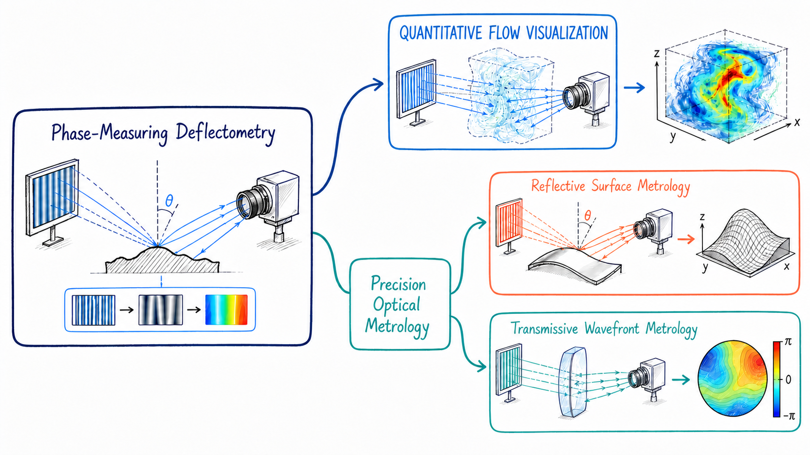
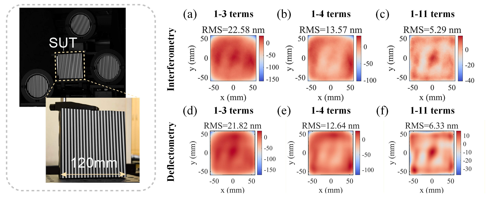
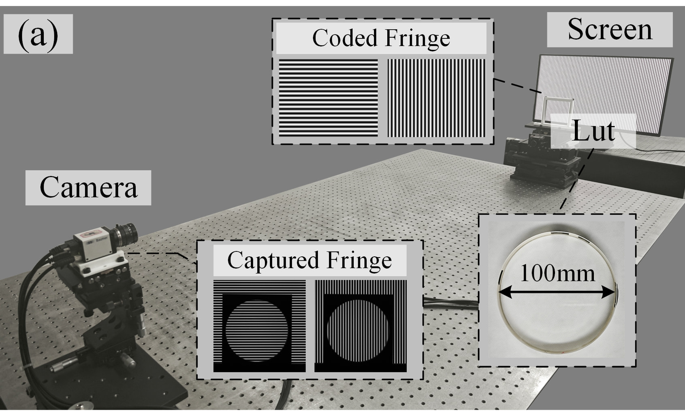
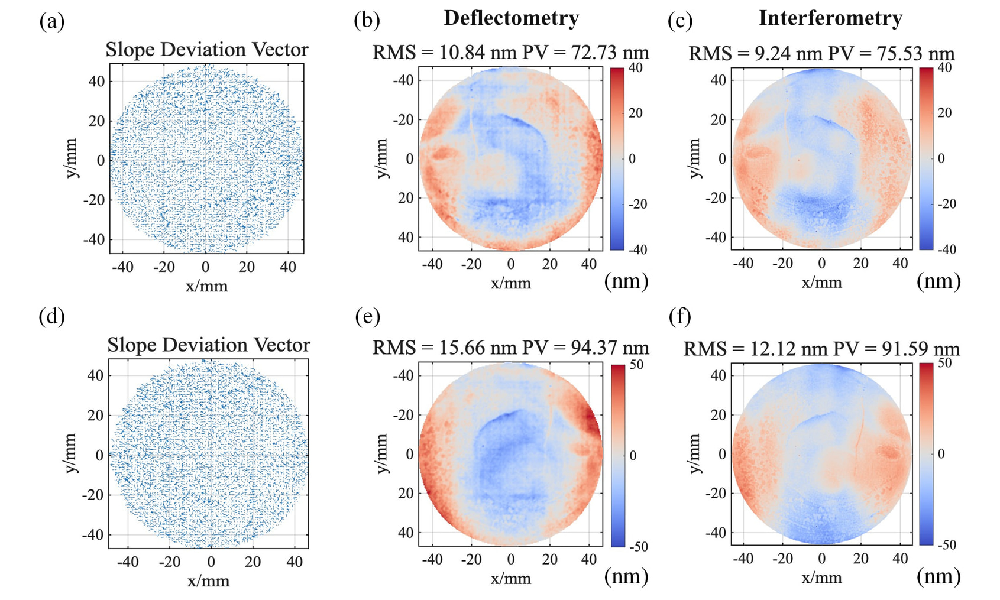
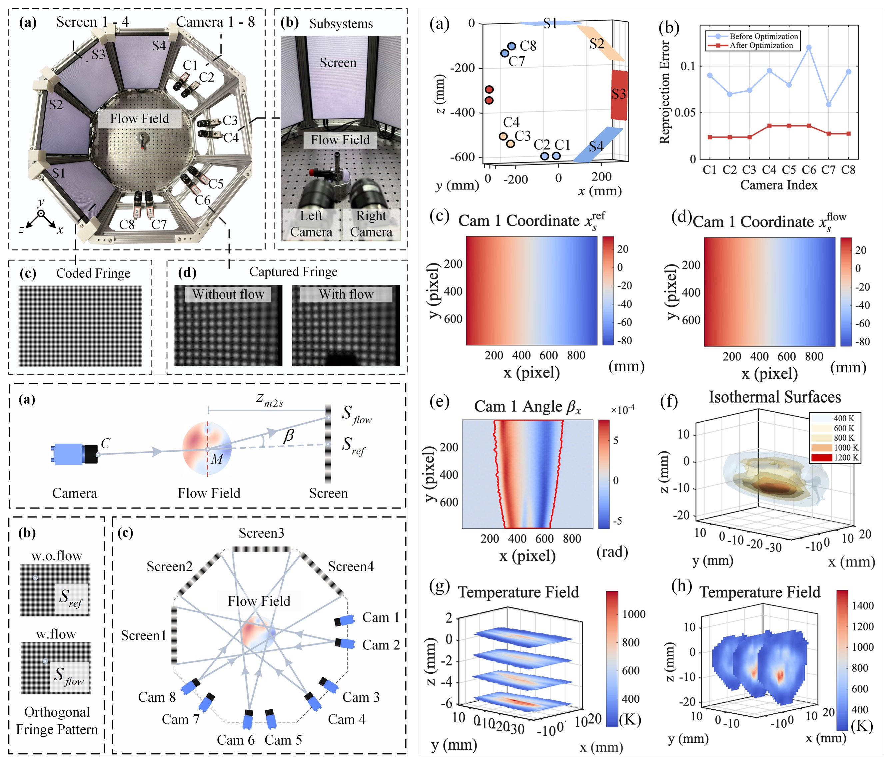

---

<table>
  <tr>
    <td width="62%" valign="top">

### Hi there — I'm Zekun 👋

**PhD candidate in Optical Engineering** at Sichuan University, China, working in Prof. Dahai Li’s research group.

My research focuses on **phase-measuring deflectometry (PMD)** for high-accuracy, high-precision measurement of optical wavefronts and specular surfaces. My work spans two complementary directions: extending deflectometry from wavefront metrology to quantitative 3D flow-field reconstruction, and advancing non-contact optical measurement toward interferometer-level accuracy.

*If light bends, there is probably a field waiting to be reconstructed.*

   </td>
    <td width="38%" align="center" valign="middle">
      
        
      <strong>Zekun Zhang</strong> 
      <code>@MarvelousZK</code>  
      <em>Optics · Imaging · Computation</em>
    </td>
  </tr>
</table>

---

## Research map

  

---

## Research toolkit

  <code>Ray Tracing</code> · <code>Camera Calibration</code> · <code>Inverse Problems</code> · <code>Scientific Visualization</code> · <code>Signal Processing</code>

---

## What I'm working on

### 🔭 Nanometre-scale Deflectometric Surface Metrology

Nanometre-scale surface-form measurement using phase-measuring deflectometry. The setup combines multi-view calibration with quantitative surface reconstruction, while the results are benchmarked against interferometric measurements across progressively extended Zernike-term ranges.

  
   
  <strong>Nanometre-scale surface metrology</strong> · experimental setup (left) and interferometry–deflectometry comparison from 1–3 to 1–11 terms (right)

### 🔬 Transmitted-wavefront Metrology

High-precision transmitted-wavefront measurement based on phase-measuring deflectometry. Measurements of high-quality flat optics show nanometre-scale agreement with interferometric results.

<table>
  <tr>
    <td width="50%" align="center" valign="top">
      
       
      <strong>Experimental setup</strong> · coded fringes, camera, screen, and 100 mm test optic
    </td>
    <td width="50%" align="center" valign="top">
      
       
      <strong>Nanometre-scale validation</strong> · deflectometry results benchmarked against interferometric measurements
    </td>
  </tr>
</table>

### 🌊 Flow-field Visualization

Quantitative visualization of refractive-index and density fields from phase-measuring deflectometry, connecting reference fringes, disturbed measurements, and reconstructed deflection fields.

<table>
  <tr>
    <td width="50%" align="center" valign="top">
      
       
      <strong>Hot-air plume</strong> · reference fringes, disturbed fringes, and the resultant deflection field
    </td>
    <td width="50%" align="center" valign="top">
      
       
      <strong>Flame flow</strong> · reference fringes, disturbed fringes, and the resultant deflection field
    </td>
  </tr>
</table>

### 🌡️ Multi-view Volumetric Temperature Reconstruction

Multi-view phase-measuring deflectometry for quantitative three-dimensional temperature-field reconstruction, combining geometry self-consistent calibration, deflection-angle recovery, and volumetric inversion.

  
   
  <strong>Multi-view volumetric temperature-field reconstruction</strong> · eight-camera acquisition, deflection-angle measurement, geometric calibration, and reconstructed isothermal surfaces

---

## Research outputs

> Synced from my public ORCID record on 13 August 2026 · **12 works**

### Journal articles

1. **[Volumetric flow field measurement deflectometry via a geometry self-consistent framework](https://doi.org/10.1364/OL.604342)** — *Optics Letters* (2026).  
   **Zekun Zhang**; Xinwei Zhang; Ruiyang Wang; Renhao Ge; Manwei Chen; Zonglin Jiang; Dahai Li

2. **[High-accuracy and full-frequency surface measurement method for specular element based on stereo deflectometry](https://doi.org/10.1016/j.measurement.2025.118874)** — *Measurement* (2026).  
   Renhao Ge; Ruiyang Wang; Dahai Li; Xinwei Zhang; **Zekun Zhang**; Manwei Chen

3. **[Noncontact Quantitative Temperature Field Reconstruction of Axisymmetric Flames With Phase Measurement Deflectometry](https://doi.org/10.1109/TIM.2025.3583365)** — *IEEE Transactions on Instrumentation and Measurement* (2025).  
   **Zekun Zhang**; Yuting Liu; Ruiyang Wang; Wei Hu; Renhao Ge; Manwei Chen; Jun Wu; Dahai Li

4. **[In situ online deflectometry with synchronized calibration and measurement](https://doi.org/10.1364/OL.562040)** — *Optics Letters* (2025).  
   Ruiyang Wang; Renhao Ge; Daewook Kim; **Zekun Zhang**; Manwei Chen; Dahai Li; Shouhuan Zhou

5. **[Sub-Nyquist sampling rate temporal correlation method for measuring the surface of the transparent planar element](https://doi.org/10.1364/OE.551309)** — *Optics Express* (2025).  
   Wanxing Zheng; Dahai Li; Ruiyang Wang; Manwei Chen; **Zekun Zhang**; Renhao Ge

6. **[In-situ high-accuracy figure measurement based on stereo deflectometry for off-axis aspheric mirror](https://doi.org/10.1364/OE.550841)** — *Optics Express* (2025).  
   Renhao Ge; Ruiyang Wang; Dahai Li; **Zekun Zhang**; Manwei Chen

7. **[Frequency-domain searching algorithm in deflectometry for measuring the surface of a transparent planar element](https://doi.org/10.1364/OL.522243)** — *Optics Letters* (2024).  
   Wanxing Zheng; Dahai Li; Ruiyang Wang; **Zekun Zhang**; Renhao Ge; Manwei Chen

8. **[Refractive index measurement deflectometry for measuring gradient refractive index lens](https://doi.org/10.1364/OE.518670)** — *Optics Express* (2024).  
   **Zekun Zhang**; Ruiyang Wang; Xinwei Zhang; Renhao Ge; Wanxing Zheng; Manwei Chen; Dahai Li

9. **[An Iterative High-Precision Algorithm for Multi-Beam Array Stitching Method Based on Scanning Hartmann](https://doi.org/10.3390/app14020794)** — *Applied Sciences* (2024).  
   Xiangyu Yan; Dahai Li; Kewei E; Fang Feng; Tao Wang; Xun Xue; **Zekun Zhang**; Kai Lu

10. **[Density field measurement deflectometry for supersonic wind tunnels](https://doi.org/10.1364/OL.485063)** — *Optics Letters* (2023).  
    Xinwei Zhang; Dahai Li; **Zekun Zhang**; Baolong Huang; Ruiyang Wang; Hongyu Pu; Zhenxin Huang; Zhi Chen

### Conference papers

1. **[Deflectometry for Planar Surfaces with Camera Lens Entrance Pupil Calibration](https://doi.org/10.1109/ICOIM60566.2023.10491461)** — *2023 2nd International Conference on Optical Imaging and Measurement (ICOIM)* (2023).  
   Renhao Ge; Dahai Li; Ruiyang Wang; Wanxing Zheng; **Zekun Zhang**

2. **[Quantitative Flow Fields Visualization Based on Deflectometry](https://doi.org/10.1109/ICOIM60566.2023.10491418)** — *2023 2nd International Conference on Optical Imaging and Measurement (ICOIM)* (2023).  
   **Zekun Zhang**; Dahai Li; Xinwei Zhang; Ruiyang Wang; Renhao Ge; Wanxing Zheng

---

## GitHub at a glance

  
  

---

*Open to conversations about optical metrology, inverse problems, computational imaging, and scientific software.*

 

---

<table>
  <tr>
    <td width="62%" valign="top">

### Hi there — I'm Zekun 👋

**PhD candidate in Optical Engineering** at Sichuan University, China, working in Prof. Dahai Li’s research group.

My research focuses on **phase-measuring deflectometry (PMD)** for high-accuracy, high-precision measurement of optical wavefronts and specular surfaces. My work spans two complementary directions: extending deflectometry from wavefront metrology to quantitative 3D flow-field reconstruction, and advancing non-contact optical measurement toward interferometer-level accuracy.

*If light bends, there is probably a field waiting to be reconstructed.*

   </td>
    <td width="38%" align="center" valign="middle">
      
        
      <strong>Zekun Zhang</strong> 
      <code>@MarvelousZK</code>  
      <em>Optics · Imaging · Computation</em>
    </td>
  </tr>
</table>

---

## Research map

  

---

## Research toolkit

  <code>Ray Tracing</code> · <code>Camera Calibration</code> · <code>Inverse Problems</code> · <code>Scientific Visualization</code> · <code>Signal Processing</code>

---

## What I'm working on

### 🌡️ Multi-view Volumetric Temperature Reconstruction

Multi-view phase-measuring deflectometry for quantitative three-dimensional temperature-field reconstruction, combining geometry self-consistent calibration, deflection-angle recovery, and volumetric inversion.

  
   
  <strong>Multi-view volumetric temperature-field reconstruction</strong> · eight-camera acquisition, deflection-angle measurement, geometric calibration, and reconstructed isothermal surfaces

### 🌊 Flow-field Visualization

Quantitative visualization of refractive-index and density fields from phase-measuring deflectometry, connecting reference fringes, disturbed measurements, and reconstructed deflection fields.

<table>
  <tr>
    <td width="50%" align="center" valign="top">
      
       
      <strong>Hot-air plume</strong> · reference fringes, disturbed fringes, and the resultant deflection field
    </td>
    <td width="50%" align="center" valign="top">
      
       
      <strong>Flame flow</strong> · reference fringes, disturbed fringes, and the resultant deflection field
    </td>
  </tr>
</table>

### 🔭 Nanometre-scale Deflectometric Surface Metrology

Nanometre-scale surface-form measurement using phase-measuring deflectometry. The setup combines multi-view calibration with quantitative surface reconstruction, while the results are benchmarked against interferometric measurements across progressively extended Zernike-term ranges.

  
   
  <strong>Nanometre-scale surface metrology</strong> · experimental setup (left) and interferometry–deflectometry comparison from 1–3 to 1–11 terms (right)

### 🔬 Transmitted-wavefront Metrology

High-precision transmitted-wavefront measurement based on phase-measuring deflectometry. Measurements of high-quality flat optics show nanometre-scale agreement with interferometric results.

<table>
  <tr>
    <td width="50%" align="center" valign="top">
      
       
      <strong>Experimental setup</strong> · coded fringes, camera, screen, and 100 mm test optic
    </td>
    <td width="50%" align="center" valign="top">
      
       
      <strong>Nanometre-scale validation</strong> · deflectometry results benchmarked against interferometric measurements
    </td>
  </tr>
</table>

---

## Research outputs

> Synced from my public ORCID record on 13 August 2026 · **12 works**

### Journal articles

1. **[Volumetric flow field measurement deflectometry via a geometry self-consistent framework](https://doi.org/10.1364/OL.604342)** — *Optics Letters* (2026).  
   **Zekun Zhang**; Xinwei Zhang; Ruiyang Wang; Renhao Ge; Manwei Chen; Zonglin Jiang; Dahai Li

2. **[High-accuracy and full-frequency surface measurement method for specular element based on stereo deflectometry](https://doi.org/10.1016/j.measurement.2025.118874)** — *Measurement* (2026).  
   Renhao Ge; Ruiyang Wang; Dahai Li; Xinwei Zhang; **Zekun Zhang**; Manwei Chen

3. **[Noncontact Quantitative Temperature Field Reconstruction of Axisymmetric Flames With Phase Measurement Deflectometry](https://doi.org/10.1109/TIM.2025.3583365)** — *IEEE Transactions on Instrumentation and Measurement* (2025).  
   **Zekun Zhang**; Yuting Liu; Ruiyang Wang; Wei Hu; Renhao Ge; Manwei Chen; Jun Wu; Dahai Li

4. **[In situ online deflectometry with synchronized calibration and measurement](https://doi.org/10.1364/OL.562040)** — *Optics Letters* (2025).  
   Ruiyang Wang; Renhao Ge; Daewook Kim; **Zekun Zhang**; Manwei Chen; Dahai Li; Shouhuan Zhou

5. **[Sub-Nyquist sampling rate temporal correlation method for measuring the surface of the transparent planar element](https://doi.org/10.1364/OE.551309)** — *Optics Express* (2025).  
   Wanxing Zheng; Dahai Li; Ruiyang Wang; Manwei Chen; **Zekun Zhang**; Renhao Ge

6. **[In-situ high-accuracy figure measurement based on stereo deflectometry for off-axis aspheric mirror](https://doi.org/10.1364/OE.550841)** — *Optics Express* (2025).  
   Renhao Ge; Ruiyang Wang; Dahai Li; **Zekun Zhang**; Manwei Chen

7. **[Frequency-domain searching algorithm in deflectometry for measuring the surface of a transparent planar element](https://doi.org/10.1364/OL.522243)** — *Optics Letters* (2024).  
   Wanxing Zheng; Dahai Li; Ruiyang Wang; **Zekun Zhang**; Renhao Ge; Manwei Chen

8. **[Refractive index measurement deflectometry for measuring gradient refractive index lens](https://doi.org/10.1364/OE.518670)** — *Optics Express* (2024).  
   **Zekun Zhang**; Ruiyang Wang; Xinwei Zhang; Renhao Ge; Wanxing Zheng; Manwei Chen; Dahai Li

9. **[An Iterative High-Precision Algorithm for Multi-Beam Array Stitching Method Based on Scanning Hartmann](https://doi.org/10.3390/app14020794)** — *Applied Sciences* (2024).  
   Xiangyu Yan; Dahai Li; Kewei E; Fang Feng; Tao Wang; Xun Xue; **Zekun Zhang**; Kai Lu

10. **[Density field measurement deflectometry for supersonic wind tunnels](https://doi.org/10.1364/OL.485063)** — *Optics Letters* (2023).  
    Xinwei Zhang; Dahai Li; **Zekun Zhang**; Baolong Huang; Ruiyang Wang; Hongyu Pu; Zhenxin Huang; Zhi Chen

### Conference papers

1. **[Deflectometry for Planar Surfaces with Camera Lens Entrance Pupil Calibration](https://doi.org/10.1109/ICOIM60566.2023.10491461)** — *2023 2nd International Conference on Optical Imaging and Measurement (ICOIM)* (2023).  
   Renhao Ge; Dahai Li; Ruiyang Wang; Wanxing Zheng; **Zekun Zhang**

2. **[Quantitative Flow Fields Visualization Based on Deflectometry](https://doi.org/10.1109/ICOIM60566.2023.10491418)** — *2023 2nd International Conference on Optical Imaging and Measurement (ICOIM)* (2023).  
   **Zekun Zhang**; Dahai Li; Xinwei Zhang; Ruiyang Wang; Renhao Ge; Wanxing Zheng

---

## GitHub at a glance

  
  

---

*Open to conversations about optical metrology, inverse problems, computational imaging, and scientific software.*

 

